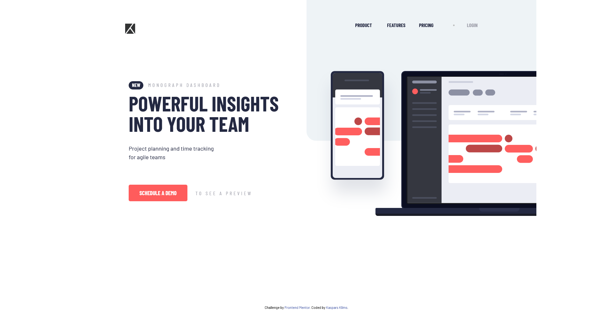

# Frontend Mentor - Project tracking intro component solution

This is a solution to the [Project tracking intro component challenge on Frontend Mentor](https://www.frontendmentor.io/challenges/project-tracking-intro-component-5d289097500fcb331a67d80e/hub/project-tracking-intro-component-IYGqaG-zW). Frontend Mentor challenges help you improve your coding skills by building realistic projects.

## Table of contents

## Overview

### The challenge

Users should be able to:

- View the optimal layout for the site depending on their device's screen size
- See hover states for all interactive elements on the page
- Create the background shape using code

### Screenshot

### Links

- Solution URL: [Add solution URL here](https://your-solution-url.com)
- Live Site URL: [Add live site URL here](https://your-live-site-url.com)

## My process

Had some challanges along the way,mainly positioning, but had a lot of fun too.
Should always PLAN on paper for example, the layout first.

### Built with

- Semantic HTML5 markup
- CSS/SASS
- Flexbox
- CSS Grid
  -JavaScript

### What I learned

Starting to get a bit faster and better with grid. Will try to refacture more and impement DRY code

### Continued development

Will try my next project using only mainly FLEXBOX, to understand it a lot better.

### Useful resources

A good article here: https://www.freecodecamp.org/news/understanding-flexbox-everything-you-need-to-know-b4013d4dc9af/

## Author

- Frontend Mentor - [@kliimish](https://www.frontendmentor.io/profile/kliimish)

## Acknowledgments

Could really be awesome to hear some tips on where i could improve even more :)
